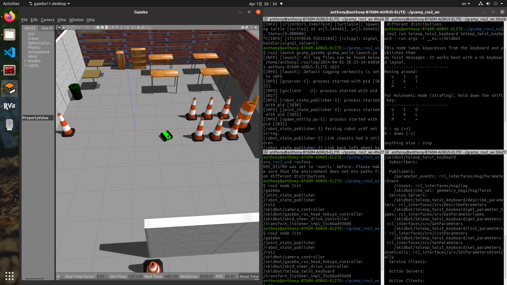
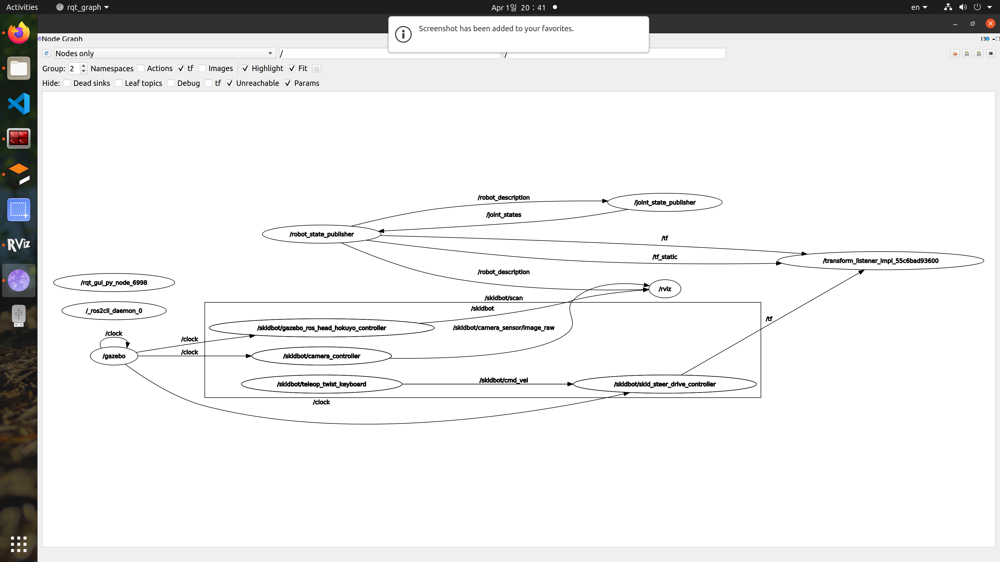

# Node and Package

Node는 ROS2가 동작의 단위이고, package는 프로그램의 단위이다.

## Node

- ROS 프로그램은 node들과 node들 간의 통신으로 구성된다.

RC Car를 만드는 상황에서 Node를 어떻게 구성해야 할까?

- Camera Node : 카메라로부터 RGB-D 데이터를 받는다.
- LiDAR Node : 라이다로부터 point cloud 데이터를 받는다.
- 판단 Node : camera와 lidar로부터 수집된 데이터로부터 의미를 추출하고 판단을 내린다.
- Moter Node : 판단한 결과를 바탕으로 모터를 제어한다.

## Topic, Service, Action

각각의 장단점을 알고 프로그래밍 방식을 알아야 한다.

## ROS2 Node Command

**단일 노드 실행 명령어**

```ros
ros2 run [PACKAGE_NAME] [PROGRAM_NAME]
```

**실행 중인 Node들의 리스트를 확인하는 명령어**

```ros
ros2 node list
```

**특정 Node의 정보 살펴보기**

```ros
ros2 node info [NODE_NAME]
```

키보드를 이용해 GAZEBO 상의 모바일 로봇을 control하는 예제



```ros
anthony@anthony-B760M-AORUS-ELITE:~/gcamp_ros2_ws$ ros2 node list
/gazebo
/joint_state_publisher
/robot_state_publisher
/rviz
/skidbot/camera_controller
/skidbot/gazebo_ros_head_hokuyo_controller
/skidbot/skid_steer_drive_controller
/skidbot/teleop_twist_keyboard
/transform_listener_impl_55c6bad93600
```

```ros
anthony@anthony-B760M-AORUS-ELITE:~/gcamp_ros2_ws$ ros2 node info /skidbot/teleop_twist_keyboard
/skidbot/teleop_twist_keyboard
Subscribers:

Publishers:
/parameter_events: rcl_interfaces/msg/ParameterEvent
/rosout: rcl_interfaces/msg/Log
/skidbot/cmd_vel: geometry_msgs/msg/Twist
Service Servers:
/skidbot/teleop_twist_keyboard/describe_parameters: rcl_interfaces/srv/DescribeParameters
/skidbot/teleop_twist_keyboard/get_parameter_types: rcl_interfaces/srv/GetParameterTypes
/skidbot/teleop_twist_keyboard/get_parameters: rcl_interfaces/srv/GetParameters
/skidbot/teleop_twist_keyboard/list_parameters: rcl_interfaces/srv/ListParameters
/skidbot/teleop_twist_keyboard/set_parameters: rcl_interfaces/srv/SetParameters
/skidbot/teleop_twist_keyboard/set_parameters_atomically: rcl_interfaces/srv/SetParametersAtomically
Service Clients:

Action Servers:

Action Clients:
```

## Rqt

**Rqt 실행 명령어**

```ros
rqt_graph
```



- 각 동그라미는 node를 의미한다.
- 화살표는 한 node에서 다른 node로 데이터를 보내고 있다는 것이다.
- 화살표 중간에 있는 것은 데이터를 보낼 때의 이름이다.

## Package

여러 package를 조합해서 로봇을 만든다.

하나의 github repository가 package다.

descriptioin : 로봇의 모델링(외관)에 관한 package

drive : 하드웨어 drive와 상호작용하는 package

주로 사용되는 package는 동일한 것이 많다.

urdf : modeling file

파일 관점 : 관련된 라이브러리, 모델링 파일, 설정 파일들을 모아둔 폴더

기능 관점 : 시뮬레이션, 하드웨어, 모델링, 원격 조종 등으로 분리시킨 모듈
